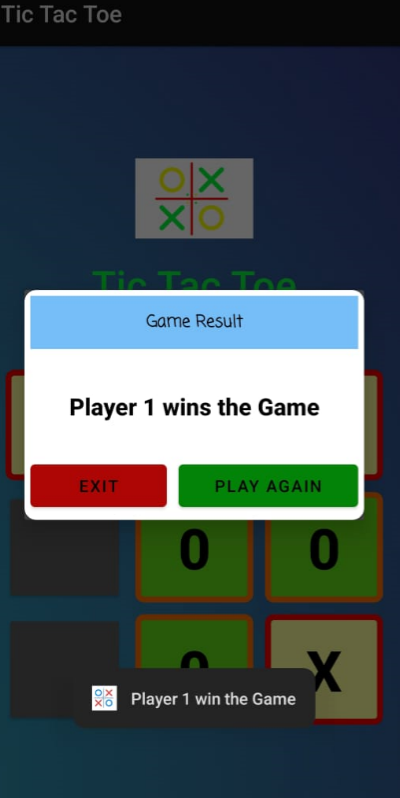
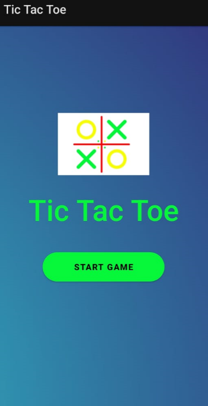
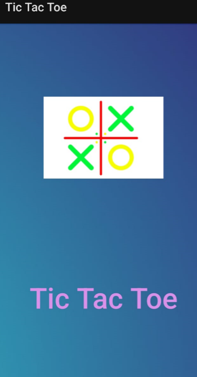

# 🎮 Tic Tac Toe Android App

A classic 2-player Tic Tac Toe game built for Android. The app features smooth animations, a splash screen, and dialogs to display the game results. It supports all winning conditions and allows players to reset and replay the game easily.

## 🛠️ Technologies Used

- Kotlin  
- Android SDK  
- XML for UI layouts  
- Material Design Components  
- Git & GitHub for version control  

## ✨ Features

- Interactive 3x3 grid game board  
- Player turns with X and O symbols  
- Dialog popup showing winner or draw  
- Splash screen on app launch  

## 🚀 How to Run
````
1. Clone this repository  
2. Open it in Android Studio  
3. Build and run the app on your device or emulator  
````

## 🖼️ Screenshots

  
*The game board where players take turns*

  
*Start Tic Tac Toe Game*

  
*App splash screen*

